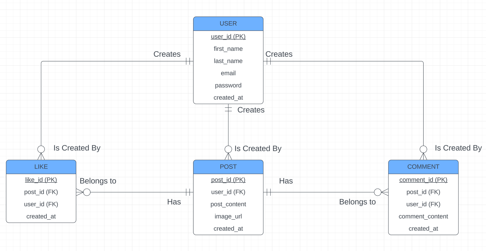
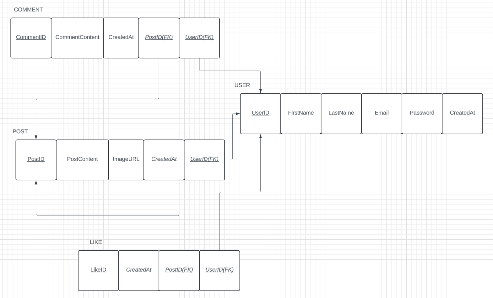

# Overview

ChimeIn is a social platform where users can post content, it's a space designed for sharing thoughts, gifs, images

## Features

- User Authentication: Secure user registrationg and login
- Post Creation: Users can create posts to share their thoughts and images
- Commenting: Users can add their thoughts and replies under any post
- Likes: Each post shows how many likes it has received
- Feed Display: View a real-time feed of all posts , showing the latest posts at the top

# Setup instructions

0. Start the mysql server

1. Navigate to the Backend Directory
   `cd /backend`
2. install backend dependencies
   `npm install`
3. create '.env' file in the root folder of backend directory and setup your '.env' file with your MySQL credntials:

   DB_HOST=localhost
   DB_USER=root
   DB_PASSWORD=password
   DB_NAME = user_auth

4. Navigate to frontend folder
   `cd /frontend`

5. install backend dependencies
   `npm install`

6. start the backend server
   `npm start`

7. the expected output on the server console is this:

"Server running on http://localhost:8081
Connected to MySQL server
Database user_authv3 created or exists
Using database user_authv3
Users table created or already exists"

9. Run the frontend application
   `npm run dev`

10. USER - POST
    Business Rule: A USER may create any number of POSTS, but each POST must be created by exactly one USER.
    <entity> <minimum cardinality> <relationshop> <maximum> <cardinality> <entity>
    <USER> <may> <Create> <any number> <POSTS>
    <POST> <must be created by> <exactly one> <USER>

User - Comment
Business Rule: A USER may create any number of COMMENTS, but each COMMENT must be created by exactly one USER.
<USER> <may create> <any number> <COMMENTS>
<COMMENT> <must be created by> <exactly one> <USER>

User - Like
Business Rule: A USER may give any number of LIKES, but each LIKE must be created by exactly one USER.
<USER> <may> <give> <any number> <LIKES>
<LIKE> <must be created by> <exactly one> <USER>

Post - Like
Business Rule: A POST may have any number of LIKES, but each LIKE must belong to exactly one POST.
<POST> <may have> <any number> <LIKES>
<LIKE> <must belong to> <exactly one> <POST

Post - Comment
Business Rule: A POST may have any number of COMMENTS, but each COMMENT must belong to exactly one POST.
<POST> <may have> <any number> <COMMENTS>
<COMMENT> <must belong to> <exactly one> <POST>

